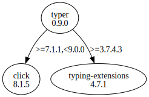

# Third Party Dependencies

<!--[[[fill sbom_sha256()]]]-->
The [SBOM in CycloneDX v1.4 JSON format](https://github.com/sthagen/pilli/blob/default/sbom.json) with SHA256 checksum ([512caa1a ...](https://raw.githubusercontent.com/sthagen/pilli/default/sbom.json.sha256 "sha256:512caa1a8e58b6642c9296b5ea25f1917a841c6bd719dffa0b1b03f8a84cc5f5")).
<!--[[[end]]] (checksum: 7ddc5e85f6be4f670d51ff174743ec54)-->
## Licenses 

JSON files with complete license info of: [direct dependencies](direct-dependency-licenses.json) | [all dependencies](all-dependency-licenses.json)

### Direct Dependencies

<!--[[[fill direct_dependencies_table()]]]-->
| Name                                       | Version                                        | License     | Author            | Description (from packaging data)                                  |
|:-------------------------------------------|:-----------------------------------------------|:------------|:------------------|:-------------------------------------------------------------------|
| [typer](https://github.com/tiangolo/typer) | [0.7.0](https://pypi.org/project/typer/0.7.0/) | MIT License | Sebastián Ramírez | Typer, build great CLIs. Easy to code. Based on Python type hints. |
<!--[[[end]]] (checksum: 3dd7af6d734cb53754e2854ec89b9dc7)-->

### Indirect Dependencies

<!--[[[fill indirect_dependencies_table()]]]-->
| Name                                          | Version                                        | License     | Author         | Description (from packaging data)         |
|:----------------------------------------------|:-----------------------------------------------|:------------|:---------------|:------------------------------------------|
| [click](https://palletsprojects.com/p/click/) | [8.1.3](https://pypi.org/project/click/8.1.3/) | BSD License | Armin Ronacher | Composable command line interface toolkit |
<!--[[[end]]] (checksum: dc3a866a7aa3332404bde3da87727cb9)-->

## Dependency Tree(s)

JSON file with the complete package dependency tree info of: [the full dependency tree](package-dependency-tree.json)

### Rendered SVG

Base graphviz file in dot format: [Trees of the direct dependencies](package-dependency-tree.dot.txt)



### Console Representation

<!--[[[fill dependency_tree_console_text()]]]-->
````console
typer==0.7.0
  - click [required: >=7.1.1,<9.0.0, installed: 8.1.3]
````
<!--[[[end]]] (checksum: 68a14cf00ff89129f24e70f991f10244)-->
