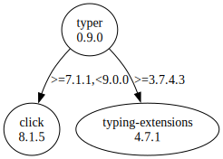

# Third Party Dependencies

<!--[[[fill sbom_sha256()]]]-->
The [SBOM in CycloneDX v1.4 JSON format](https://git.sr.ht/~sthagen/prosessilouhinta/blob/default/sbom/cdx.json) with SHA256 checksum ([cb51f6d7 ...](https://git.sr.ht/~sthagen/prosessilouhinta/blob/default/sbom/cdx.json.sha256 "sha256:cb51f6d7bb2467fe933b525f096a898cd49bd63e82cbd66811449fc5ca8e2490")).
<!--[[[end]]] (checksum: c11882fc3be57c69248783071ed1c30a)-->
## Licenses 

JSON files with complete license info of: [direct dependencies](direct-dependency-licenses.json) | [all dependencies](all-dependency-licenses.json)

### Direct Dependencies

<!--[[[fill direct_dependencies_table()]]]-->
| Name                                       | Version                                        | License     | Author            | Description (from packaging data)                                  |
|:-------------------------------------------|:-----------------------------------------------|:------------|:------------------|:-------------------------------------------------------------------|
| [typer](https://github.com/tiangolo/typer) | [0.9.0](https://pypi.org/project/typer/0.9.0/) | MIT License | Sebastián Ramírez | Typer, build great CLIs. Easy to code. Based on Python type hints. |
<!--[[[end]]] (checksum: 80e791c1fdef7665f4104495541de7b1)-->

### Indirect Dependencies

<!--[[[fill indirect_dependencies_table()]]]-->
| Name                                                             | Version                                                    | License                            | Author                                                                                | Description (from packaging data)                      |
|:-----------------------------------------------------------------|:-----------------------------------------------------------|:-----------------------------------|:--------------------------------------------------------------------------------------|:-------------------------------------------------------|
| [click](https://palletsprojects.com/p/click/)                    | [8.1.5](https://pypi.org/project/click/8.1.5/)             | BSD License                        | UNKNOWN                                                                               | Composable command line interface toolkit              |
| [typing_extensions](https://github.com/python/typing_extensions) | [4.7.1](https://pypi.org/project/typing_extensions/4.7.1/) | Python Software Foundation License | "Guido van Rossum, Jukka Lehtosalo, Łukasz Langa, Michael Lee" <levkivskyi@gmail.com> | Backported and Experimental Type Hints for Python 3.7+ |
<!--[[[end]]] (checksum: e4e0711b27c84b7d53d7caceeba18d27)-->

## Dependency Tree(s)

JSON file with the complete package dependency tree info of: [the full dependency tree](package-dependency-tree.json)

### Rendered SVG

Base graphviz file in dot format: [Trees of the direct dependencies](package-dependency-tree.dot.txt)



### Console Representation

<!--[[[fill dependency_tree_console_text()]]]-->
````console
typer==0.9.0
├── click [required: >=7.1.1,<9.0.0, installed: 8.1.5]
└── typing-extensions [required: >=3.7.4.3, installed: 4.7.1]
````
<!--[[[end]]] (checksum: 6d93fba045b04b1a3b7b5a23f4a3c409)-->
